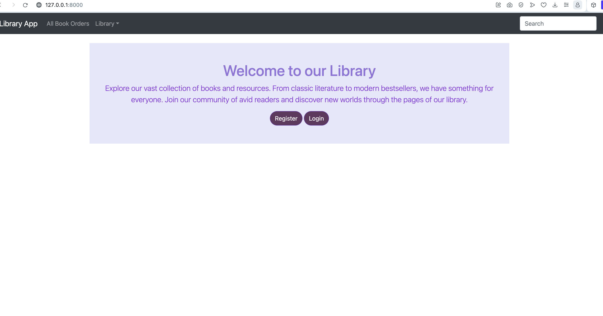
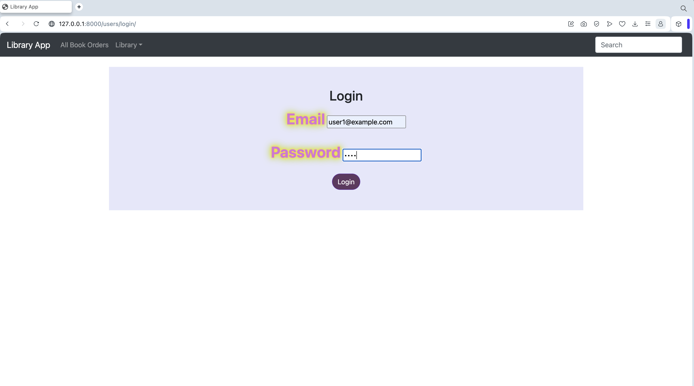
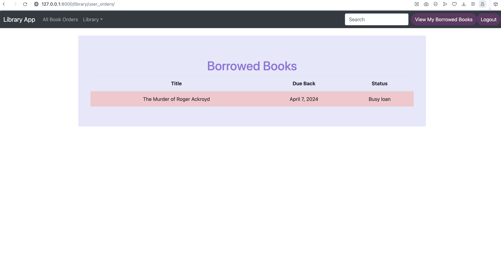
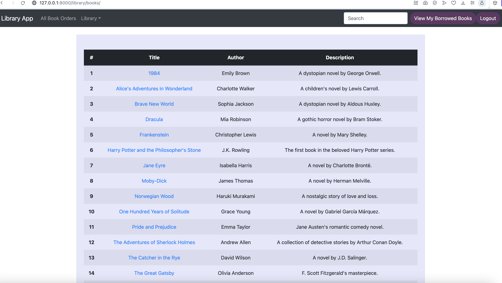
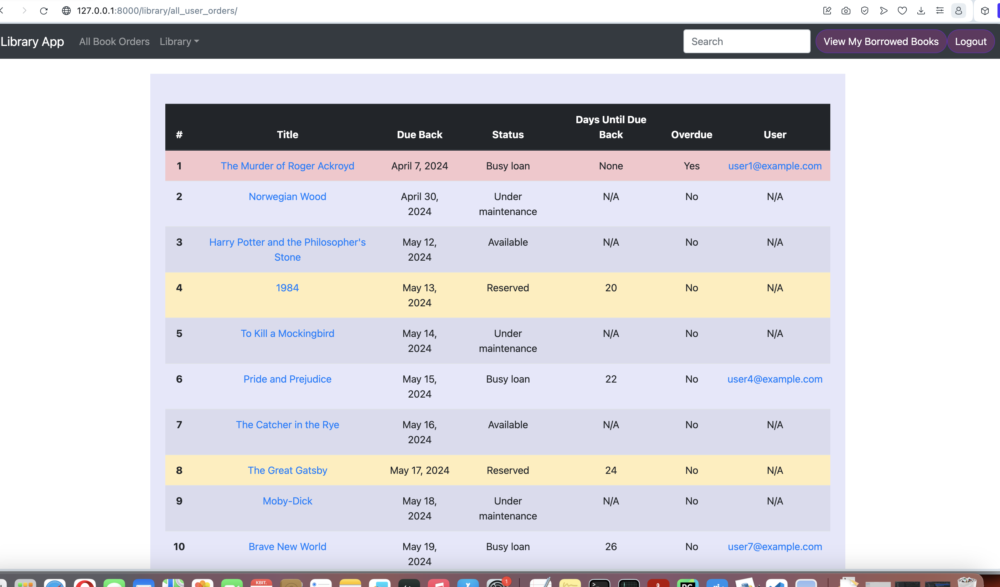

# Django Project

## This project is a web application based on Django Framework.

### Instalation

``` bash
https://github.com/Luba77/library.git
```
### Create your database on postgresql
#### Example ios:
``` bash
    psql -U postgres
    CREATE USER admin WITH PASSWORD 'pass';
    ALTER USER admin WITH SUPERUSER;
    ALTER USER admin CREATEDB CREATEROLE;
    
    CREATE DATABASE lib_db;
    GRANT ALL PRIVILEGES ON DATABASE lib_db TO admin;
    \connect lib_db;
    GRANT CREATE ON SCHEMA public TO admin;
```

## Set variables in docker-compose.yml
```bash
      POSTGRES_PASSWORD=your_postgres_pass
      POSTGRES_USER=your_postgres_user
      POSTGRES_DB=your_postgres_db_name

```

## Rename env.dev.copy on env.dev and pass credetials

## Run command :
```
docker-compose build
docker-compose up -d
docker-compose exec web python manage.py migrate --noinput
```

## Load fixtures

### Test users :
```bash
cd src 
docker-compose exec web python manage.py loaddata library/operations/fixtures/users.json
```

### Authors :
```bash
docker-compose exec web python manage.py loaddata library/operations/fixtures/authors.json
```
### Books : 
```bash
docker-compose exec web python manage.py loaddata library/operations/fixtures/books.json  
```

## Genres :
```bash
docker-compose exec web python manage.py loaddata library/operations/fixtures/genres.json
```
## Status of books :
```bash
docker-compose exec web python manage.py loaddata library/operations/fixtures/bookcopies.json
```

# Attention :
## Set new password for test user :
```bash
 docker-compose exec web python manage.py changepassword user1@example.com
```
#### write new password 2 times and use when login

## Functionality :
### Main page:

### Login page:
```angular2html
    use test login and password after docker-compose exec web python manage.py changepassword user1@example.com
```

### See details of loaned books of request user in session:

### See all books in library:

### See all books with details of users statuses :


# Test other functionality, such a seach by author, book, overdue books and users
